# LabVIEW Usage

The LabVIEW version of PathPlannerLib can function as a drop-in replacement of the standard LabVIEW trajectory, or it can be used to create a standard LabVIEW trajectory.  The LabVIEW library is designed with identical calls so that the documentation is interchangable.

# Examples

## Load a Path

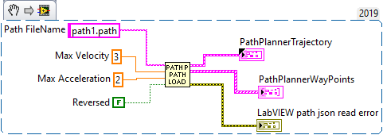

# Menu
After installation, a Path Planner function palette is added to the WPILIB Third Party menu.

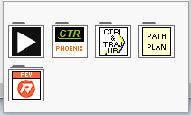

Path Planner top palette

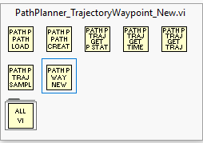

Path Planner sub palette containing menus for all routines

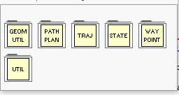

# Documentation

## PathPlanner
This class contains methods for easily loading and generating path files from the RoboRIO storage.

**PathPlanner_LoadPath**

Load and create a PathPlannerTrajectory from a path file containing PathPlanner Waypoints.

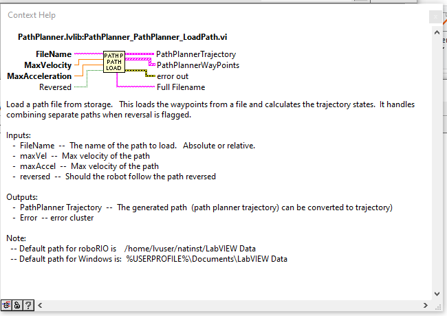

---

**PathPlanner_CreatePath**

Create  a PathPlannerTrajectory from the passed array of PathPlanner Waypoints.  (This is a LabVIEW version extension.)

---

## PathPlannerTrajectory

**PathPlannerTraj_GetTrajectory**

Extract the Trajectory Library Trajectory from a PathPlanner Trajectory.  (This is a LabVIEW version extension.)

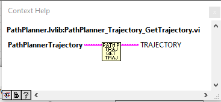

---

**PathPlannerTrajectory_sample**

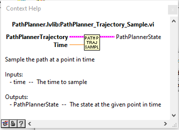

---

**PathPlannerTrajectory_getInitialState**

Get the initial state of the path

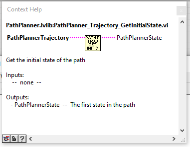

---

**PathPlannerTrajectory_getEndState**

Get the end state of the path

---

**public PathPlannerTrajectory_getState**

Get a state in the path based on its index.  
In most cases, using sample() is a better method.

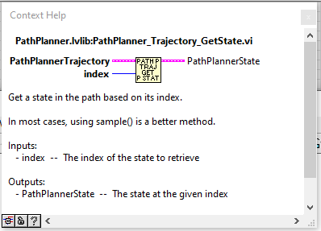

---

**public PathPlanner_Trajectory_GetStates**

Get an array of all of the states in the path.

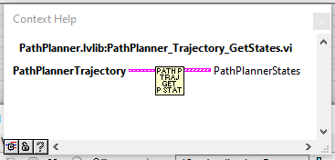

---

**numStates**

Get the total number of states in the path

NO LABVIEW EQUIVALENT.  CAN USE LABVIEW ARRAY SIZE TO GET THIS.

---

**PathPlanner_Trajectory_GetTotalTime**

Get the total runtime of the path

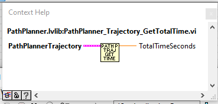

---

## PathPlanner_TrajectoryWaypoint

**PathPlanner_TrajectoryWaypoint_New**

Create a new waypoint from its parts

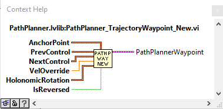

---

## PathPlannerState

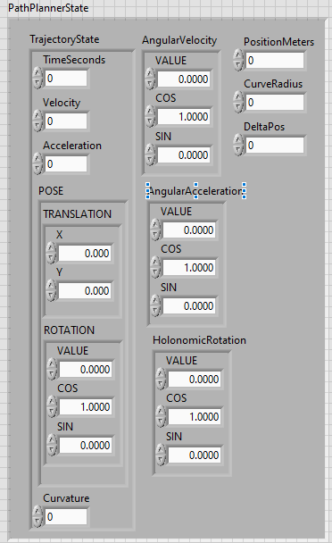

 * `time` **units::second_t** — The time elapsed since the beginning of the path
* `position` **units::meter_t** — The distance traveled at this point in the path. Forward robot motion will add to this value and reversed motion will subtract from it. Think of this as what the robot's encoder position would be.
 * `velocity` **units::meters_per_second_t** — The speed at this point in the path
 * `acceleration` **units::meters_per_second_squared_t** — The acceleration at this point in the path
 * `pose` **frc::Pose2d** — The pose at this point in the path
 * `curvature` **units::curvature_t** — The curvature at this point in the path
 * `angularVel` **units::radians_per_second_t** — The angular velocity at this point in the path. (Rate of change of robot heading)
 * `angularAccel` **units::radians_per_second_squared_t** — The angular acceleration at this point in the path. (Rate of change of angular velocity)
 * `holonomicRotation` **frc::Rotation2d** — The rotation of the robot if using holonomic mode. The rotation value of the `poseMeters` field will remain the direction of travel.

## PathPlanner_TrajectoryWaypoint

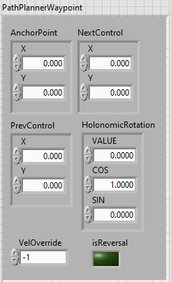

