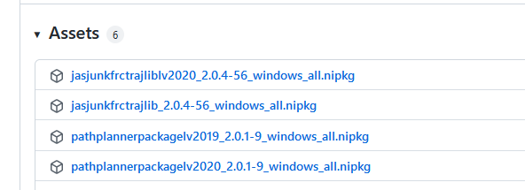

# LabVIEW Teams

PathPlannerLib is provided for installation as a NI Package (NIPKG) file.  Follow these steps to download and install:

1. Download the PathPlanner package and pre-requisite packages.  PathPlanner depends on the LabVIEW trajectory library.  The install packages for both of these can be found here: 
https://github.com/jsimpso81/FRC_LV_TrajLib/releases/latest  
Download the packages required for the version of LabVIEW being used.  The LabVIEW 2020 packages have 2020 embedded within their file name.  The other packages are for LabVIEW 2019.  FRC 202 is using LabVIEW 2020.

2. Install the prerequisite Trajectory Library.  After downloading, double click on the NIPKG file to start the installation.  The NI Certificates package is not required.  That checkbox can be un-checked.  Otherwise selecting the defaults will work.

3. Install the PathPlanner library.  Double click on the NIPKG file to start the installation.  The NI Certificates package is not required.  That checkbox can be un-checked.  Otherwise selecting the defaults will work.

4. Close and re-open LabVIEW.  This will load the new Third Pary Library menus.

## Usage
* [LabVIEW Usage](/PathPlannerPackage/LabVIEWusage.md)

