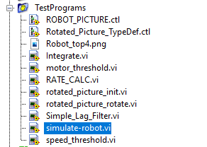
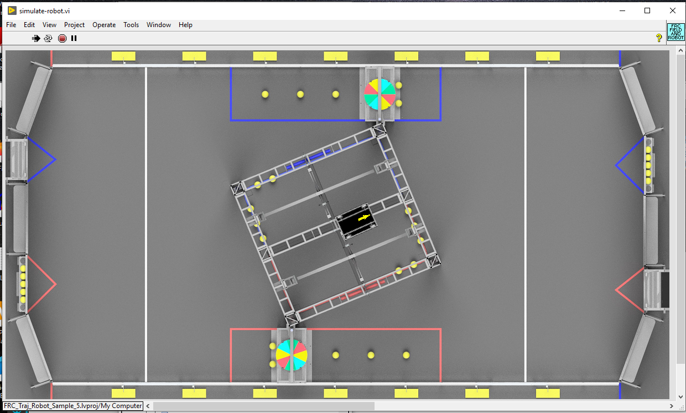
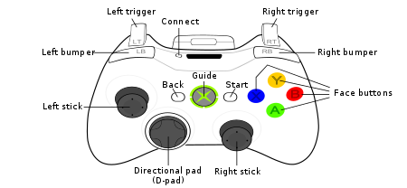
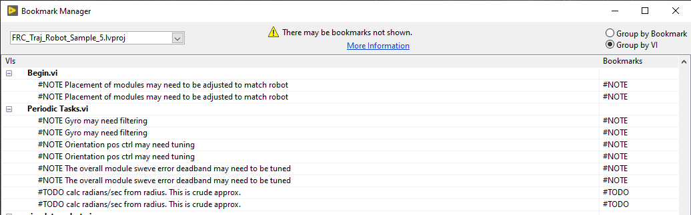
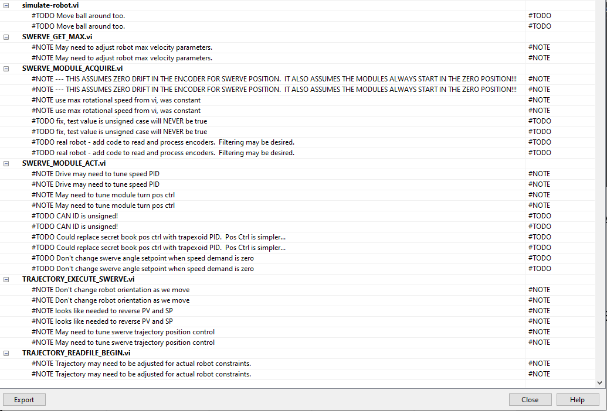
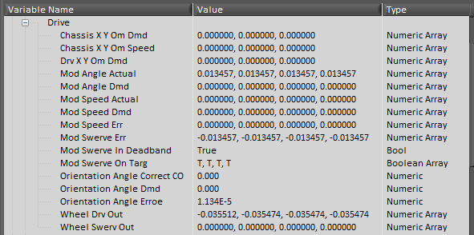
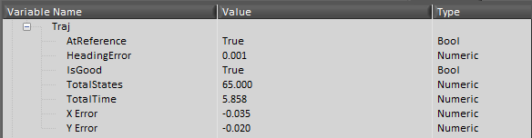
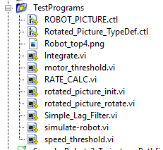

X
## FRC LabVIEW Trajectory Robot Sample 5 Project

This sample robot based on the standard LabVIEW robot project, contains both a simulated and physical robot that reads and executes a trajectory using a simple **swerve** robot.  (No swerve drive is really simple...)  This sample robot demonstrate the FRC LabVIEW Trajectory Library.  This library is an UNOFFICIAL port of the Java/C++ 
WPILIB routines that don't already exist in LabVIEW.  Before using these projects, install the library.  Here is a link to the github repository for the library.  https://github.com/jsimpso81/FRC_LV_TrajLib

Similar to sample 2, this robot code reads a trajectory file.  Otherwise this sample robot is quite different than the other samples.  It implements and simulates a swerve drive robot code that can read and execute a trajectory. `BEGIN.VI` subVI calls other subVI to initialize the robot for operation and read the trajectory file for later execution. `PERIODIC TASKS.VI` performs all the control functions to read sensors, keep track of where the robot is, and control the motors to move the robot around.  `TELEOP.VI` reads inputs from the drivers and generates desired X, Y, speeds and rotational orientation for the robot, including executing a trajectory when requested by pressing the desired button.  The trajectory will stop executing as soon as the button is released.

The simulated robot target code runs on a PC. The physical robot target code, after modifying the code to match the robot's hardware, can be run on an FRC robot.  

This robot code does not have an autonomous routine to execute a trajectory, but you could easily add that.

### Simulated Robot

This robot runs somewhat differently in simulation.  Instead of executing `Robot Main.VI`, execute `simulate-robot.vi`.  
This will display an overhead simulation screen.  The other simulation screen will appear, but it should be ignored.

To run the simulated robot:
1. Start the FRC Driverstation and optionally start the dashboard.
1. In the LabVIEW project under the "Computer" target, open 'simulate-robot.vi' under the **Test Programs** folder and press the run arrow.  
1. A simulated field should be displayed.  Communications with the driver station should be established.
1. Use the driver station to change the mode to "teleop enabled", then use the joystick to drive the robot.

NOTE:  Ignore the *standard* simulation field.  Only the overhead swerve robot and field update.

### Physical Robot

This sample could be modfied to run on a physical robot.  At a minimum, the following would need to be done.
The robot code needs to be modified to:
1. match the hardware that exists on the physical robot.
2. use the physical robot's swerve drive locations.
3. tune the serve drive and wheel drive control parameters.
4. tune the robot orientation control
5. add filtering if needed for gyro and wheel encoder readings.

### Joystick control map

The teleop controls were assigned to an game (xbox) type controller.

- **Left Stick Y** -- Drive robot forward and backwards
- **Right Stick X** -- Drive robot left and right (robot orientation stays the same)
- **Right Trigger** -- Spin robot orientation clockwise
- **Left Trigger** -- Spin robot orientation counter-clockwise
- **A** -- Execute trajectory (robot orientation stays the same)
- **B** -- Execute trajectory (robot orientation points in direction of travel)
- **X** -- Execute trajectory in reverse (robot orientation stays the same)
- **Y** -- Execute trajectory in reverse (robot orientation points in direction of travel)
- **Start** -- Enable closed loop trajectory control (default)
- **Back** -- Disable closed loop trajectory control.

When not executing a trajectory, combinations of the other controls can be used to drive the robot.  
For example, **Left Stick Y** and **Right Trigger** pressed at the same time will cause the robot to travel in a circle. 

### Items that may need to be customized

Bookmarks in the LabVIEW project describe some items that may need to be customed on the simulated and physical robots to maximize performance.  

More bookmarks

### Using a Custom Trajectory

New trajectory files can be created and used.  If the file name is kept the same, no code changes are needed.  Remember to copy the trajectory file to the correct location for the simulated robot or deploy the new trajectory file to the roboRIO.

### Custom Dashboard

This repository contains a custom Dashboard project that contains additional tabs to help track trajectory progress.

### Network Table Variables

This sample robot publishes a number of Network Table variables that can be used to observe drive and trajectory progress and performance.

Drive System variables

Trajectory variables

### Custom Code

All the code customizations are compartmentalized into separate routines that are then called by the standard 
routines in the **Team Code** project directory.

These are the trajectory related custom subVI

These are utility custom subVI

---
File last updated: 8/6/2020
