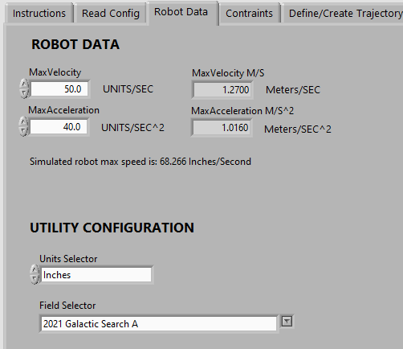
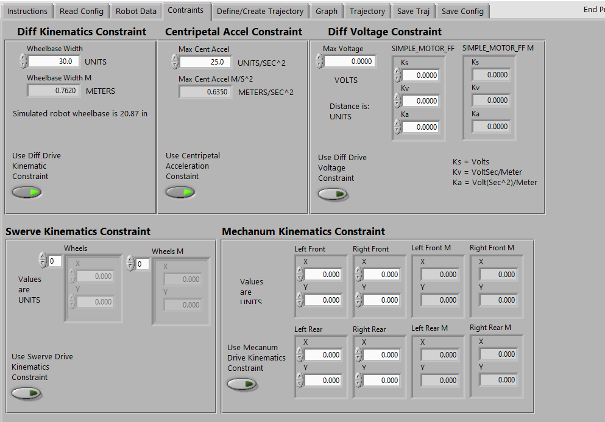
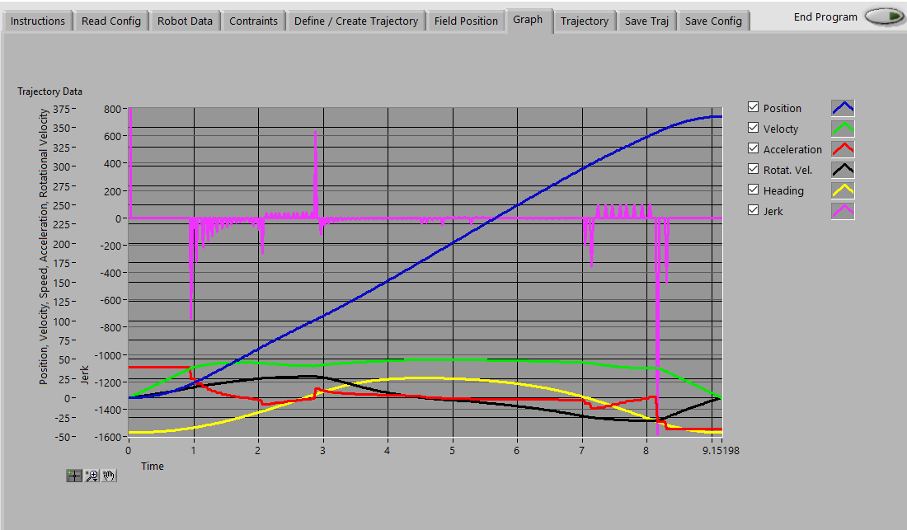
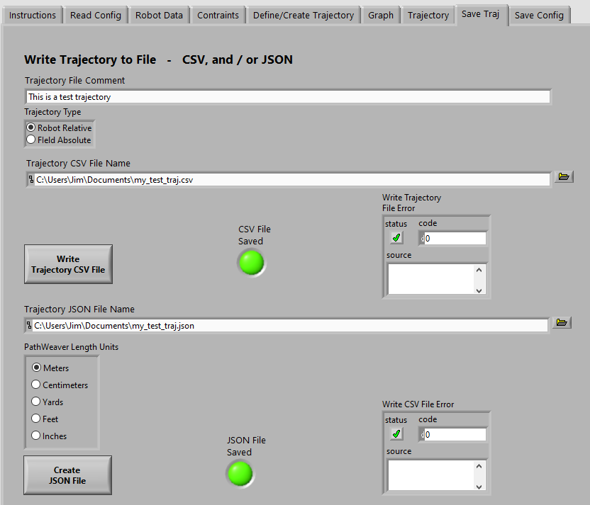
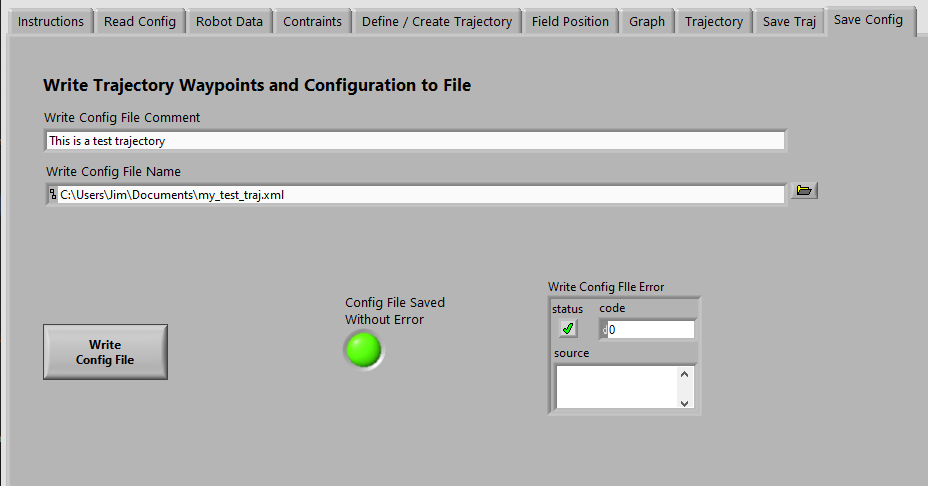
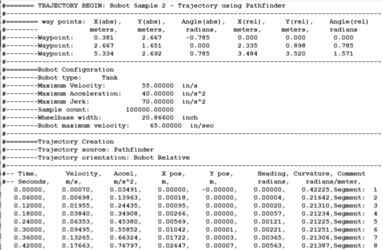

## FRC_Traj_Util Project

This LabVIEW project contains the source and build specifications for the 4 utilties
installed with the FRC LabVIEW Trajectory Library.  These utilities create trajectory files
and convert trajectory files from one type to another.  They can be used regardless 
of the programming language used on the robot.  The utilities are:

- **Create Trajectory Using Trajectory Library**

	Create a trajectory using the trajectory library routines and write it to a CSV (comma separated value) file and/or
	a JSON file that can be copied to a RoboRIO and read by the robot code.  The trajectory configuration can be written
	to an XML file and read back to allow iterative trajectory creation and modification.  The trajectory is created by:

	1. Defining robot properties
	1. Defining drive system constraints
	1. Defining the trajectory "waypoints".
	1. Creating and reviewing the trajectory.  If changes need to be made to back to steps *i*,*ii*,*iii* as needed.
	1. Write the trajectory to a file, CSV and/or JSON.
	1. Write the trajectory configuration to a file.
	1. Read a trajectory configuration from a file.

	**Sample screen shot**

	

	

	

	

	

	

	

	

	

	**Sample trajectory file**

	

- **Create_Trajectory_Using_PathfinderDifferential**

	Create a trajectory using Jaci Brunning's Pathfinder library for a robot using a "differential drive" and write it to a 
	CSV (comma separated value) file that can be
	copied to a RoboRIO and read by the robot code.

	More information on Pathfinder can be found here https://github.com/JaciBrunning/Pathfinder  
	One of the biggest differences between this Trajectory Library and Pathfinder is that Pathfinder uses S curves instead of
	trapezoids.

	**Sample trajectory file**

	

- **Create_Trajectory_Using_PathfinderSwerve**

	Create a trajectory using Jaci Brunning's Pathfinder library for a robot using a "swerve drive" and write it to a 
	CSV (comma separated value) file that can be
	copied to a RoboRIO and read by the robot code.    

	More information on Pathfinder can be found here https://github.com/JaciBrunning/Pathfinder  
	One of the biggest differences between this Trajectory Library and Pathfinder is that Pathfinder uses S curves instead of
	trapezoids.

- **Convert PathWeaver JSON File To Trajectory File**

	Read a JSON file created by the PathWeaver utility.  Write this trajectory as a CSV file for use with this library.

- **Convert Trajectory CSV file to PathWeaver JSON file**

	Read a Trajectory CSV file created by the Create Trajectory utility.  Write this trajectory as a JSON file for use by Java/C++ WPILIB programs.

---
File last updated: 1/19/2021

